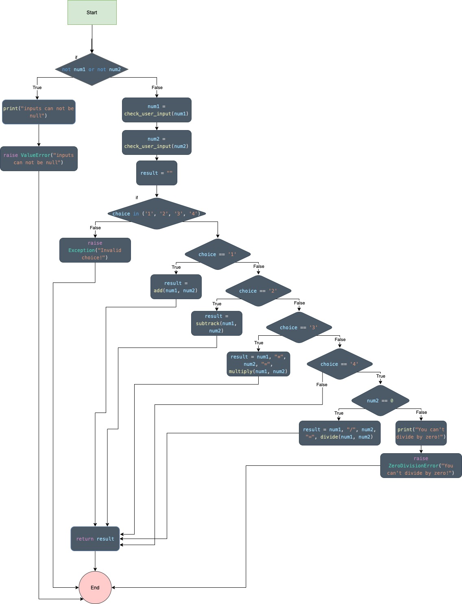

# Testing in Python: Unit Tests
## Flow graph analysis (CFG
### Check User Input Graph

### Add Graph

### Subtract Graph

### Multiply Graph

### Divide Graph

### Calculate Graph

### isExit Graph

## The Independent Paths
### Check User Input Paths
| **Independent Paths**                                                                                                                       	| **Inputs**    	| **Output** 	| **Visibility Type** 	|
|---------------------------------------------------------------------------------------------------------------------------------------------	|---------------	|------------	|---------------------	|
| Start => input == "" ? True => print("input cant be empty" ) => raise valueError => End                                                     	| input = ''    	| ValueError 	| Visible             	|
| Start => input == "" ? False => try => val = int(input) => return val => End                                                                	| input = '1'   	| 1          	| Visible             	|
| Start => input == "" ? False => try => catch ValueError => try => val = float(input) => return val => End                                   	| input = '1.1' 	| 1.1        	| Visible             	|
| Start => input == "" ? False => try => catch ValueError => try => Catch ValueError => print(input is not number) => raise ValueError => End 	| input = 'x'   	| ValueError 	| Visible             	|
### Add Paths
| **Independent Paths**                           	| **Inputs**    	| **Output** 	| **Visibility Type** 	|
|-------------------------------------------------	|---------------	|------------	|---------------------	|
| Start => result = x + y => return result => End 	| x = 1 , y = 2 	| result = 3 	| Visible             	|
### Subtract Paths
| **Independent Paths**                           	| **Inputs**    	| **Output** 	| **Visibility Type** 	|
|-------------------------------------------------	|---------------	|------------	|---------------------	|
| Start => result = x - y => return result => End 	| x = 3 , y = 2 	| result = 1 	| Visible             	|
### Multiply Paths
| **Independent Paths**                           	| **Inputs**    	| **Output** 	| **Visibility Type** 	|
|-------------------------------------------------	|---------------	|------------	|---------------------	|
| Start => result = x * y => return result => End 	| x = 3 , y = 2 	| result = 6 	| Visible             	|
### Divide Paths
| **Independent Paths**                                                                          	| **Inputs**    	| **Output**        	| **Visibility Type** 	|
|------------------------------------------------------------------------------------------------	|---------------	|-------------------	|---------------------	|
| Start => y == 0 ? True => print("you can't divide by zero!") => raise ZeroDivisionError => End 	| x = 1 , y = 0 	| ZeroDivisionError 	| Visible             	|
| Start => y == 0 ? False => x == 0 ? True => return 0 => End                                    	| x = 0 , y = 1 	| 0                 	| Visible             	|
| Start => y == 0 ? False => x == 0 ? False => result = x/y => return result => End              	| x = 6 , y = 2 	| result = 3        	| Visible             	|
### Calculate Paths
| **Independent Paths**                                                                                                                                                                                                                                                                                                                      	| **Inputs**                           	| **Output**        	| **Visibility Type** 	|
|--------------------------------------------------------------------------------------------------------------------------------------------------------------------------------------------------------------------------------------------------------------------------------------------------------------------------------------------	|--------------------------------------	|-------------------	|---------------------	|
| Start => not num1 or not num2 ? True => print("inputs can not be null") => raise ValueError => End                                                                                                                                                                                                                                         	| num1 = None, num2 = None, choice = 1 	| ValueError        	| Visible             	|
| Start => not num1 or not num2 ? False => num1= check_user_input(num1) => num2 = check_user_input(num2) => result = "" => choice in (1,2,3,4) False => raise exception => End                                                                                                                                                               	| num1 = 1, num2 = 1, choice = 5       	| Exception         	| Visible             	|
| Start => not num1 or not num2 ? False => num1= check_user_input(num1) => num2 = check_user_input(num2) => result = "" => choice in (1,2,3,4) True => choice =="1" ? True => result = add(num1,num2) => return result => End                                                                                                                	| num1 = 1, num2 = 2, choice = 1       	| result = 3        	| Visible             	|
| Start => not num1 or not num2 ? False => num1= check_user_input(num1) => num2 = check_user_input(num2) => result = "" => choice in (1,2,3,4) True => choice =="1" ? False => choice =="2" ? True => result = subtract(num1,num2) => return result => End                                                                                   	| num1 = 3, num2 = 2, choice = 2       	| result = 1        	| Visible             	|
| Start => not num1 or not num2 ? False => num1= check_user_input(num1) => num2 = check_user_input(num2) => result = "" => choice in (1,2,3,4) True => choice =="1" ? False => choice =="2" ? False => choice =="3" ? True => result = muliply(num1,num2) => return result => End                                                            	| num1 = 2, num2 = 3, choice = 3       	| result = 6        	| Visible             	|
| Start => not num1 or not num2 ? False => num1= check_user_input(num1) => num2 = check_user_input(num2) => result = "" => choice in (1,2,3,4) True => choice =="1" ? False => choice =="2" ? False => choice =="3" ? False=> choice =="4" ? True => num2==0 ? False => result = divide(num1,num2) => return result => End                   	| num1 = 6, num2 = 2, choice = 4       	| result = 3        	| Visible             	|
| Start => not num1 or not num2 ? False => num1= check_user_input(num1) => num2 = check_user_input(num2) => result = "" => choice in (1,2,3,4) True => choice =="1" ? False => choice =="2" ? False => choice =="3" ? False=> choice =="4" ? True => num2==0 ? True => print ("You can't divide by zero!") => raise ZeroDivisionError => End 	| num1 = 1, num2 = '0', choice = 4     	| ZeroDivisionError 	| Visible             	|
| Start => not num1 or not num2 ? False => num1= check_user_input(num1) => num2 = check_user_input(num2) => result = "" => choice in (1,2,3,4) True => choice =="1" ? False => choice =="2" ? False => choice =="3" ? False=> choice =="4" ? True => num2==0 ? True => print ("You can't divide by zero!") => raise ZeroDivisionError => End 	| num1 = 1, num2 = 0, choice = 4       	| ZeroDivisionError 	| Invisible           	|
### isExit Paths
| **Independent Paths**                                                                                     	| **Inputs**                	| **Output** 	| **Visibility Type** 	|
|-----------------------------------------------------------------------------------------------------------	|---------------------------	|------------	|---------------------	|
| Start => next_calculation == "no" ? True => return true => End                                            	| next_calculation  = "no"  	| True       	| Visible             	|
| Start => next_calculation == "no" ? False => next_calculation == "yes" ? True => return false => End      	| next_calculation  = "yes" 	| False      	| Visible             	|
| Start => next_calculation == "no" ? False => next_calculation == "yes" ? False => raise ValueError => End 	| next_calculation  = "Yes" 	| ValueError 	| Visible             	|
## Reports
### Code Coverage Report

### [Nosetests Report](https://github.com/v5ln/UnitTestInPython/blob/main/nosetests.xml)
